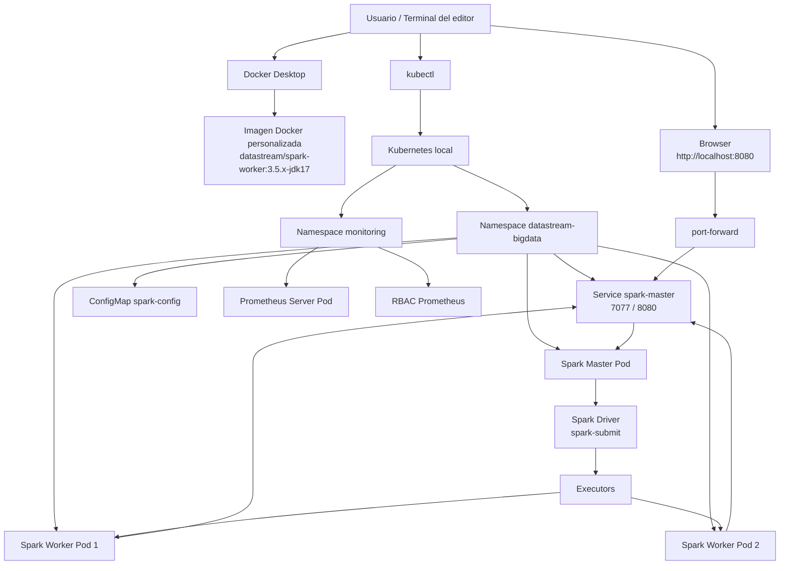
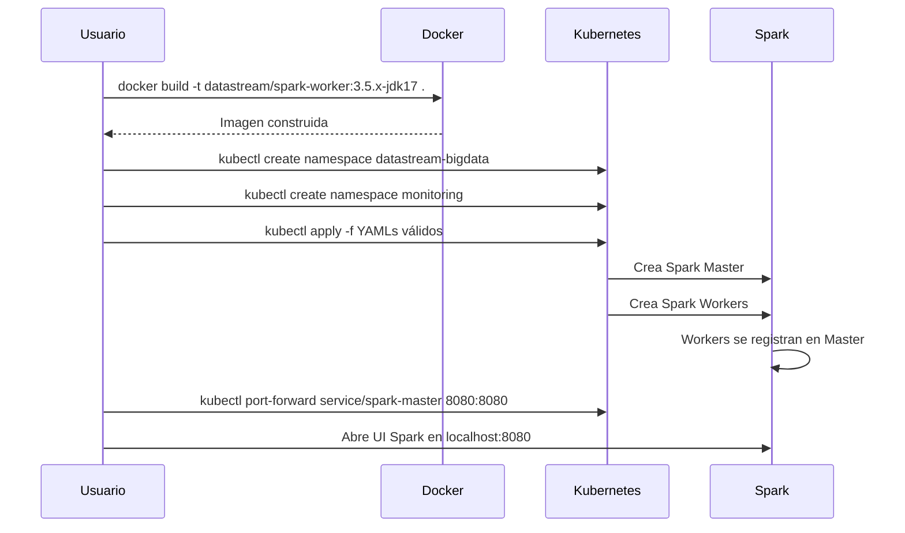
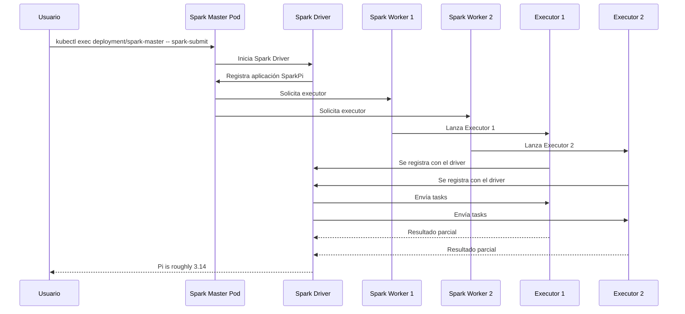
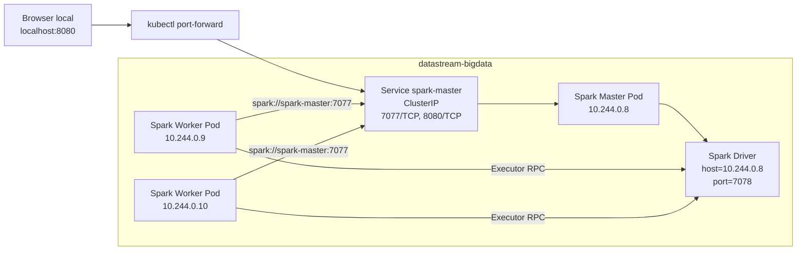
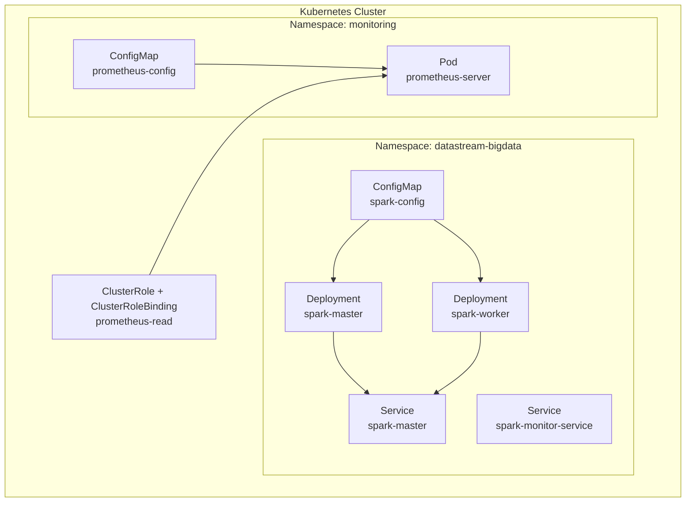

# Diagrama de bloques del sistema

Este documento presenta los diagramas principales del proyecto `bigdata-lab`.

Los diagramas están escritos en **Mermaid**, por lo que pueden visualizarse directamente en GitHub, GitLab, VS Code, PyCharm con plugin Mermaid o cualquier visor compatible.

---

## 1. Diagrama general de bloques



---

## 2. Flujo de despliegue



---

## 3. Flujo de ejecución de job Spark



---

## 4. Diagrama de red interno



---

## 5. Diagrama de componentes Kubernetes



---

## 6. Leyenda

| Elemento | Significado |
|---|---|
| Service | Punto estable de comunicación dentro de Kubernetes |
| Pod | Unidad mínima de ejecución en Kubernetes |
| Deployment | Controlador que mantiene Pods activos |
| ConfigMap | Recurso para configuración no sensible |
| Executor | Proceso Spark que ejecuta tareas |
| Driver | Proceso Spark que coordina la aplicación |
| Master | Coordinador de recursos Spark |
| Worker | Nodo lógico que ejecuta executors |

---

## 7. Lectura rápida del sistema

```text
El usuario construye una imagen Docker.
Kubernetes despliega Master y Workers.
Los Workers se conectan al Service spark-master.
El usuario lanza un spark-submit dentro del Spark Master.
El Driver coordina el job.
Los Executors ejecutan las tareas en los Workers.
El resultado aparece en terminal y la aplicación queda registrada como Completed en la UI.
```
